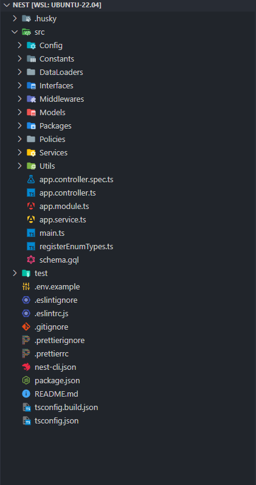
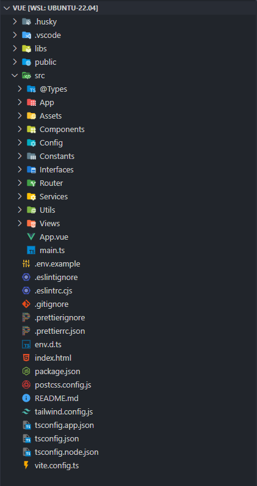

Hi, i'm Malanx Dev, a self-taught full-stack web developer

**Languages, tools and clouds:**

**Previews:**
 

**References:**

- Nestjs - Graphql: https://docs.nestjs.com/graphql/quick-start
- Vuejs - Pinia: https://pinia.vuejs.org/introduction.html
- Tailwind CSS: https://tailwindcss.com/docs/configuration
- Apollo - Graphql: https://www.apollographql.com/docs/
- UI Sharing Resource: https://github.com/demon-bixia/Avian-Template
